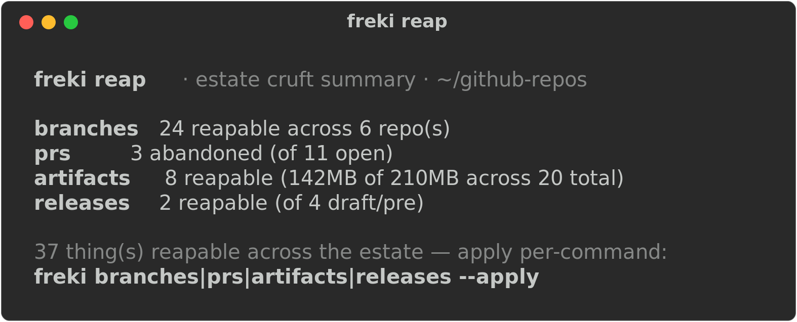

# freki

The reaper of your GitHub estate — finds and clears the cruft (stale branches, dead PRs, old CI
artifacts, stale draft releases). Named for Odin's wolf: the pack's hunter, and its most dangerous
member.

<p align="center">
  
</p>

In Norse myth Odin keeps two ravens, **Huginn** (*thought*) and **Muninn** (*memory*), and two wolves,
**Geri** and **Freki** (both meaning roughly "the ravenous one"). The ravens
([`huginn`](https://github.com/brett-buskirk/huginn), [`muninn`](https://github.com/brett-buskirk/muninn))
observe and remember — they're read-only. The wolves have teeth: [`geri`](https://github.com/brett-buskirk/geri)
hunts down what's dangerous or stale (outdated deps, advisories, drift); **freki reaps it** — merged
and abandoned branches, dead PRs, old artifacts, stale releases — across the whole estate.

> **Freki is the one tool in the pack that deletes things — so it's the most dangerous, and it
> defaults to safe.** Every command is **dry-run by default**: it lists exactly what it *would*
> remove and stops. Nothing is deleted until you pass `--apply`, and destructive `--apply` runs still
> confirm before touching anything, unless you also pass `--yes`.

## Safety

These rules are non-negotiable, and they're enforced in code, not just documentation:

- **Dry-run is the default.** Every command prints what it *would* do and exits without mutating.
  `--apply` is required to delete anything.
- **Confirms before deleting**, even with `--apply` — unless you also pass `--yes`. The confirmation
  prompt reads from `/dev/tty`, so a piped or scripted stdin can't accidentally skip it.
- **Never touches:** the default/protected branch · unmerged branches (without explicit `--force`,
  and even then it confirms) · published releases and their tags · anything with recent activity.
- **Respects exemptions** — repos in `repo-conventions/exemptions.json` (shared with huginn) or
  listed in `$HUGINN_FAMILY` are skipped entirely, everywhere.
- **Logs every deletion** it actually makes to `~/.local/state/freki/reaped.log` (repo, kind, detail,
  UTC timestamp) so an `--apply` run is auditable after the fact.
- **GitHub-only, for now.** No cloud-resource deletion (droplets, buckets, volumes) — that's a
  deferred phase with its own auth and safety model. See [ROADMAP.md](ROADMAP.md).

## Status

**v1.0.0 — released.** All five commands (`branches`, `prs`, `artifacts`, `releases`, `reap`) work
against the live estate, dry-run by default, respecting exemptions and every safety rail; `--apply`
deletes only what was listed. Config-driven with two-level help, `shellcheck`-clean in CI, and passes
`huginn doctor freki` clean. GitHub-only for now — see [ROADMAP.md](ROADMAP.md) for what's deferred.

## Install

Requirements: `bash`, `git`, [`gh`](https://cli.github.com) (authenticated), `jq`.

```bash
git clone git@github.com:brett-buskirk/freki.git ~/github-repos/freki
ln -s ~/github-repos/freki/freki ~/.local/bin/freki   # ~/.local/bin must be on your PATH
```

freki manages the repos in **`$FREKI_ROOT`** (default `~/github-repos`) — the same estate huginn
manages. If you already run `huginn`, freki picks up its config automatically (see
[Configuration](#configuration)); there's nothing extra to set up.

## Commands

```
reap
  branches [--apply]    merged/stale branches, estate-wide
  prs [--apply]         abandoned open PRs
  artifacts [--apply]   old CI workflow artifacts
  releases [--apply]    stale draft / pre-releases
  reap                  the combined cruft summary (dry-run only)
reference
  help                  this menu
```

`branches` lists every merged or long-stale local + remote branch across the estate. Merged branches
are always eligible for `--apply`; stale-but-unmerged branches need `--force` too. It never touches
the default branch, the currently checked-out branch, or an unmerged/active branch.

`prs` lists every open PR across the estate, flagging ones with no activity in `$FREKI_PR_STALE_DAYS`
(default 180 days); `--apply` closes the abandoned ones with a courteous comment.

`artifacts` lists non-expired GitHub Actions artifacts by age/size; `--apply` deletes those at or past
`$FREKI_STALE_DAYS` (default 90 days). Already-expired artifacts are left alone — GitHub reclaims
those on its own.

`releases` lists stale draft releases and old pre-releases (same `$FREKI_STALE_DAYS` threshold);
`--apply` deletes the release entry (the underlying git tag, if any, is left alone). Never touches a
published (non-draft, non-prerelease) release or its tag.

`reap` is a **dry-run-only** combined summary across all four — an estate-wide "here's the cruft"
headline. It never deletes anything itself; apply per-command.

All reaping commands exclude exempt repos, and a destructive `--apply` run confirms once for the
whole batch before doing anything (skip the prompt with `--yes`).

Run **`freki <command> help`** for details and options on any command. For a one-page reference to
every command, option, and behavior — including the dry-run/`--apply` safety model — see the
[**cheat sheet**](CHEATSHEET.md).

## How it works

- **Estate model** — identical to huginn's: any top-level directory under `$FREKI_ROOT` containing a
  `.git` folder is a managed repo. No stored state; everything is derived live via `git`/`gh` — no
  caching, no daemon, no telemetry.
- **Exemptions, shared with huginn** — freki reads `repo-conventions/exemptions.json` and merges it
  with the `$HUGINN_FAMILY` env var, the same convention huginn/muninn use. A repo listed there is
  never touched by any freki command.
- **Respects `NO_COLOR`** and non-TTY output.

## Configuration

Settings resolve **environment variable → config file → smart default**, same precedence as huginn.
Config file: `${XDG_CONFIG_HOME:-~/.config}/freki/config` (override with `FREKI_CONFIG`). If a key
isn't set there, freki falls back to `~/.config/huginn/config` before using the built-in default — a
huginn user gets a working freki with zero setup.

| Key / env var | Falls back to | Default | Purpose |
|---|---|---|---|
| `FREKI_ROOT` | `HUGINN_ROOT` | `~/github-repos` | directory of repos to manage |
| `FREKI_OWNER` | `HUGINN_OWNER` | your `gh` login | GitHub owner of the estate repos |
| `FREKI_STALE_DAYS` | _(none)_ | `90` | days since the last commit for a branch to count as stale |
| `FREKI_PR_STALE_DAYS` | _(none)_ | `180` | days with no activity for a PR to count as abandoned |
| `FREKI_CONVENTIONS` | `HUGINN_CONVENTIONS` | `repo-conventions` | dir under the root with `exemptions.json` |
| — | `HUGINN_FAMILY` | _(none)_ | space-separated repos to exclude, merged with `exemptions.json` |

## Backstory

freki is the fourth tool in the [huginn](https://github.com/brett-buskirk/huginn) /
[muninn](https://github.com/brett-buskirk/muninn) / [geri](https://github.com/brett-buskirk/geri) /
freki estate-management pack — see huginn's README for the fuller story of why this exists.

## License

[MIT](LICENSE) © 2026 Brett Buskirk
